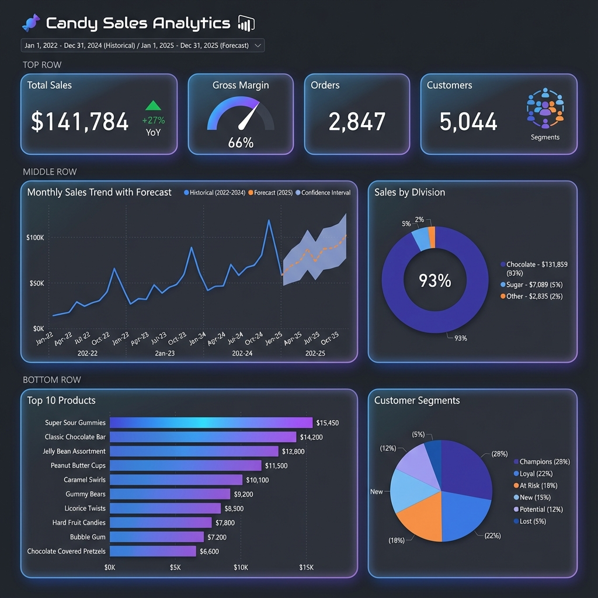

# 🍬 Candy Sales Dashboard - Design Specification

> **Version**: 1.0  
> **Date**: 2025-12-10

## 📊 Dashboard Mockup



---

## 🎯 Dashboard Overview

A comprehensive Power BI dashboard for **Candy Distributor Sales Analytics** featuring:
- Real-time KPIs with YoY comparisons
- Sales trends with ML forecasts
- Product and customer segmentation analysis

---

## 📐 Layout Specification

### Page 1: Executive Summary

#### Row 1: KPI Cards (4 cards)

| Card | Measure | Format | Conditional |
|------|---------|--------|-------------|
| Total Sales | `[Total Sales]` | $#,0 | ↑ Green if YoY > 0 |
| Gross Margin | `[Gross Margin %]` | 0.0% | Gauge 50-70% |
| Orders | `[Order Count]` | #,0 | - |
| Customers | `[Customer Count]` | #,0 | Segment breakdown |

#### Row 2: Trend Charts

| Chart | Type | X-Axis | Y-Axis | Notes |
|-------|------|--------|--------|-------|
| Sales Trend | Line + Forecast | Date[Year-Month] | [Total Sales] | Add ML Forecast overlay |
| Division Sales | Donut | Division | [Total Sales] | Show % labels |

#### Row 3: Detail Charts

| Chart | Type | Category | Value |
|-------|------|----------|-------|
| Top Products | Bar (Horizontal) | Product Name | [Total Sales] |
| Customer Segments | Pie | Segment | Count |

---

### Page 2: Sales Analysis

#### Slicers
- Year (dropdown)
- Division (buttons)
- Region (dropdown)
- Ship Mode (checkbox)

#### Visuals
1. **Matrix**: Sales by State/Product
2. **Map**: Sales by Geography (bubble size = sales)
3. **Waterfall**: Monthly Sales Changes
4. **Decomposition Tree**: Sales drivers

---

### Page 3: Customer Insights

#### Visuals
1. **Scatter Plot**: RFM Analysis (Frequency vs Monetary, color = Segment)
2. **Treemap**: Customers by Segment
3. **Table**: Top 20 Customers with RFM details
4. **Card Row**: Champion/Loyal/At Risk counts

---

### Page 4: ML Predictions

#### Visuals
1. **Line Chart**: Historical + 6-Month Forecast
2. **Table**: Forecast by Month
3. **KPIs**: Model Metrics (MAE, RMSE, R²)
4. **Clustered Bar**: Segment Revenue Contribution

---

## 🎨 Design Guidelines

### Color Palette

| Purpose | Color | Hex |
|---------|-------|-----|
| Primary | Blue | #0078D4 |
| Secondary | Purple | #8764B8 |
| Positive | Green | #107C10 |
| Negative | Red | #D13438 |
| Neutral | Gray | #605E5C |
| Chocolate | Brown | #8B4513 |
| Sugar | Pink | #FF69B4 |

### Typography
- **Headers**: Segoe UI Semibold, 18pt
- **Body**: Segoe UI, 11pt
- **KPI Values**: Segoe UI Bold, 32pt

### Theme
- Dark mode recommended
- Consistent card shadows
- Rounded corners (4px)

---

## 📋 Implementation Steps

### Step 1: Create KPI Cards
```
1. Add Card visual
2. Drag [Total Sales] to Values
3. Format: Display units = Auto, Value = 0 decimals
4. Add conditional formatting for positive growth
```

### Step 2: Add Trend Line with Forecast
```
1. Add Line Chart
2. X-axis: Date[YearMonth]
3. Y-axis: [Total Sales]
4. Add second Y-axis: Sales_Forecast[Forecast]
5. Enable Analytics > Forecast line
```

### Step 3: Create Division Donut
```
1. Add Donut chart
2. Legend: Candy_Sales[Division]
3. Values: [Total Sales]
4. Detail labels: % of Total
```

### Step 4: Add Customer Segment Chart
```
1. Add Pie Chart
2. Legend: Customer_Segments[Segment]
3. Values: COUNT(Customer_Segments[Customer ID])
4. Colors: Champions=Gold, At Risk=Red
```

### Step 5: Create Slicers
```
1. Add Slicer for Date[Year]
2. Add Slicer for Product[Division]
3. Sync slicers across pages
```

---

## 🔗 Data Model Reference

### Key Measures to Use

| Visual | Measures |
|--------|----------|
| KPI Cards | Total Sales, Gross Margin %, Order Count, Customer Count |
| Trend | Total Sales, Sales YoY %, Forecasted Sales |
| Products | Total Sales, Total Units, Profit per Unit |
| Segments | Champion Customers, At Risk Customers, Avg Customer Value |

---

## ✅ Checklist

- [ ] Create Executive Summary page
- [ ] Add KPI cards with conditional formatting
- [ ] Build trend chart with forecast
- [ ] Create division breakdown
- [ ] Add product ranking
- [ ] Build customer segment analysis
- [ ] Apply dark theme
- [ ] Add slicers and sync
- [ ] Test interactivity
- [ ] Publish to Power BI Service

---

*Open `Demo.pbip` in Power BI Desktop to implement this design.*
